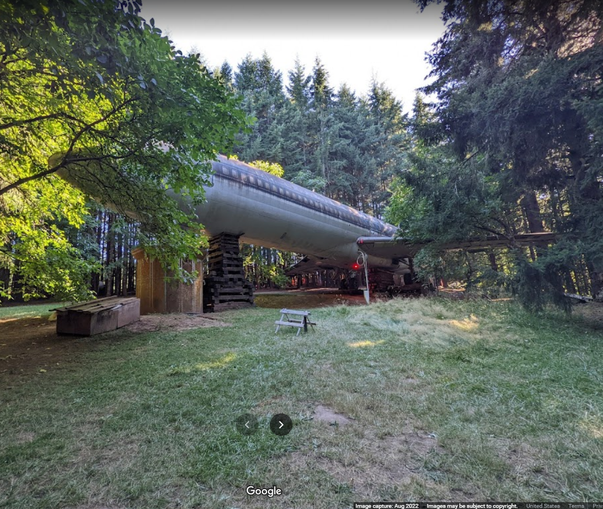
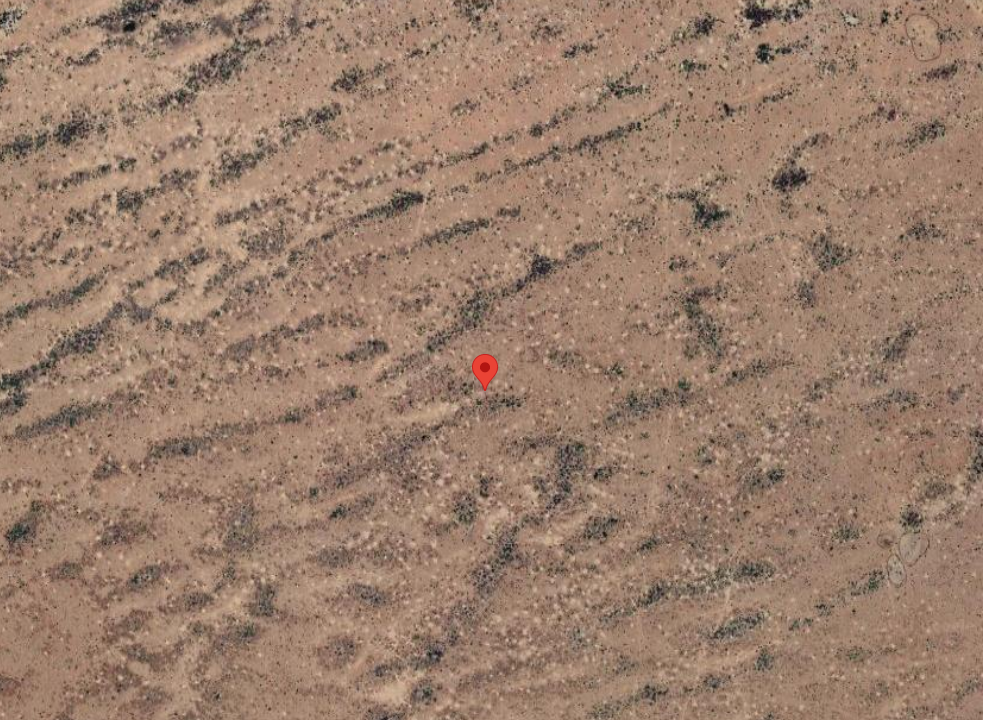
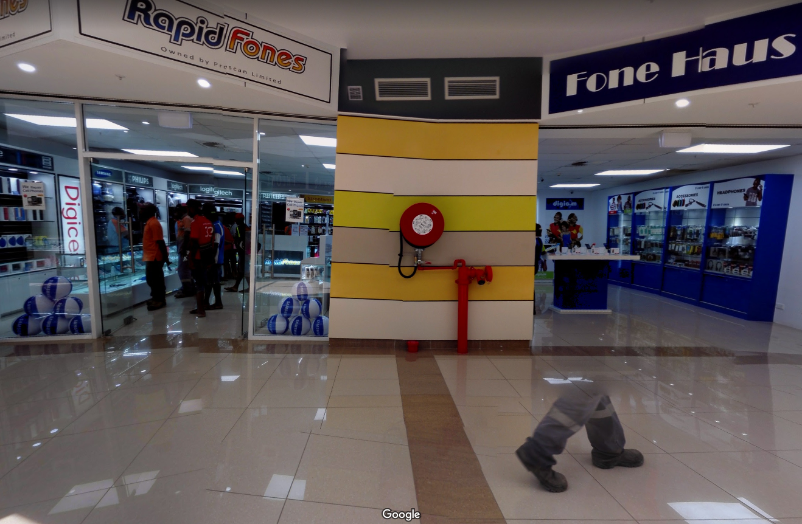
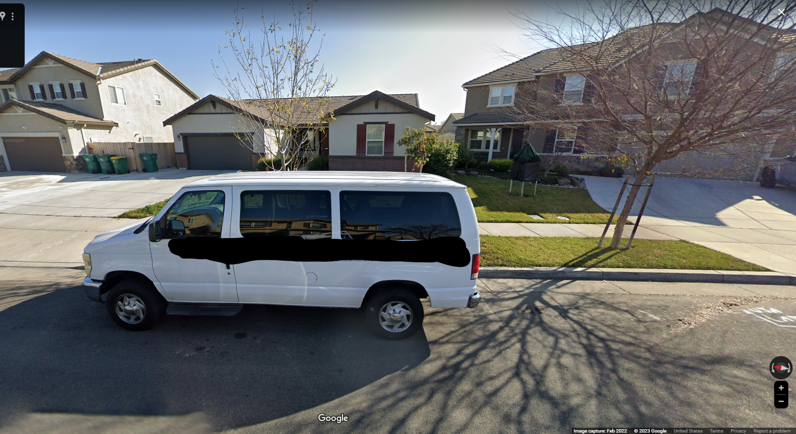

Here's an archive. To find the password, you'll need to follow the trail across the world. [Download flag.7z](./flag.7z)

1) Start with this image. Find this place. 

2) Use the phone number as N and W coords to find the coordinates pictured below. It will require quite a bit of massaging to make it fit, so here is a hint to go with the picture below: It's in Africa. 

3) To the northwest of the pin in the picture above is a region. If you swap the first letter of the first word and the first letter of the second word, you might think it’s a restaurant of some kind. Search for it, and you will see it is very close to someone's name on social media. Find out where they're from and head there next.

4) In that town, find Brian Bell. Ignore the specter walking in our midst, and look for the brand of in-ear monitors that professionals trust. On their website they will tell you of the inception of their company, which will give you the name of a band and a state. In that state there are two streets named after that band in two different towns. You're looking for the lane in the city that starts with "S". Go there next. Last step, I promise.

5) Drop a street view near the van at the bend where one musician becomes the band. On that van is a phone number. That is the password to the archive (no parenthesis, no spaces, no dash.) 

